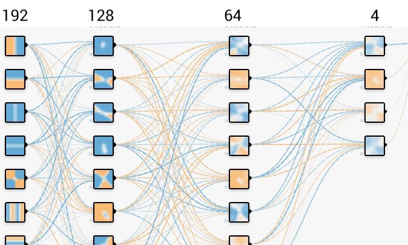
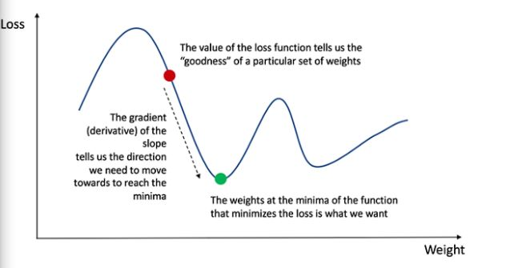

# classifyimagerotation

## Neural Network

This section of the report describes the way in which Neural Networks  was used to classify images based on their orientation. . A set of computing algorithms inspired by the structure and design of the biological neural network,Neural Networks can be used to classify data. 

Neural networks are great function approximations , neural networks learn the feature space along with the main function as opposed to the kernel methods. The activation we are using to approximate is sigmoid and the ouput of final layer is softmax.

#### Our network [9]:

  

We have 4 layers:
1. Input layer with 192 nodes
2. 1st hidden layer with 128 nodes
3. 2nd hidden layer with 64 nodes
4. Output layer with 4 nodes

#### Initialising Weight and Bias:
Weights and bias are initialised as  np.transpose(np.random.randn(n_inputs+1,n_hidden1) * np.sqrt(2/n_hidden1)). This representsa normal distribution with mean 0. the values are small and close to zeros.

#### Why layers? What does it do?
As said above, neural networks are function approximaters and the number nodes define the no. of functions that will approximate the objective loss. Having more layers allows to approximate complex functions really really well. The basic idea is , the first layer will approximate the function in some way and the next layer will use the approximation of the first layer as a unit and approximate the objective function. The third layer combines multiple of these non linear functions to even more non linear functions in order to approximate.

#### Why Neural networks.?
As data increases the accuracy in kernel methods asymptotes and doesnt increase much with more data ,also it becomes computationally expensive. Thats not the case with neaural network, since in nn we lean the feature space and we can do better and better with data.
Below are some of the terminologies used in Neural Networks,

### Training

1. **Feed forward**: 
In the feed-forward part of a neural network, predictions are made based on the values in the input nodes and the weights.

   Step 1: (Calculate the dot product between inputs and weights)
We do this in a vectorised form i.e matrix multiplications.

   Step 2: (Pass the result from step 1 through an activation function)
The result from Step 1 can be a set of any values. However, in our output we have the values in the form of 1 and 0. We want our output to be in the same format. To do so we need an activation function, which squashes input values between 1 and 0. Here we use the sigmoid function.
Other Functions: ReLu(rectified linear units, most widely used nowadays) implemented relu but incorrectly and hence stuck with sigmoid , tanh(hyperbolic tangent)

   Step 3: Output of neural network
Here we use the softmax function as activation for the final layer.

2. **Back Propagation**: 
The output of the nueral network(step 3 in feed forward) is our final output. Now we try to adjust the weight and bias such that we get minimum error. Neural network is an optimization problem (as all of machine learning can be viewed as optimization problems) where we try to minimize the loss by varying weights and biases. [10]

  

This is a loss function in 1 dimension. This is hardly the case as we have more dimensions. And our loss may look like this:[11]

  

Methods for minimizing or optimising:

1. Good old batch gradient descent(which we are using)

   In Batch Gradient Descent, all the training data is taken into consideration to take a single step. We take the average of the gradients of all the training examples and then use that mean gradient to update our parameters. So that’s just one step of gradient descent in one epoch.
Batch Gradient Descent is great for convex or relatively smooth error manifolds. In this case, we move somewhat directly towards an optimum solution.
Issues: Often gets stuck in local minima.
Tackling that issue: In order to get out of small local minima we set the learning rate and number of epoch high so that it wil only get stuck in lower miminmas.
Still not the best one. Tried stochastic , didn't work :(

2. Stochastic gradient descent(  works well in practice) 

   SGD is very noisy. However this turns out to be a crucial feature to avoid local minima and saddle points.

3. In Stochastic Gradient Descent (SGD)

   We consider just one example at a time to take a single step. We do the following steps in one epoch for SGD:
  
    1. Take an example
    
    2. Feed it to Neural Network
    
    3. Calculate it’s gradient
    
    4. Use the gradient we calculated in step 3 to update the weights
    
    5. Repeat steps 1–4 for all the examples in training data-set
 
#### Analysis

The weights and bias are outputted in a file called _nnet_model.txt_.
The predicted labels are in file ouput.txt.

The best train accuracy is **82.3%** for settings:

* Learning rate : **0.05**
* Number epochs : **1760** 
* Test accuracy: **71.3%**
